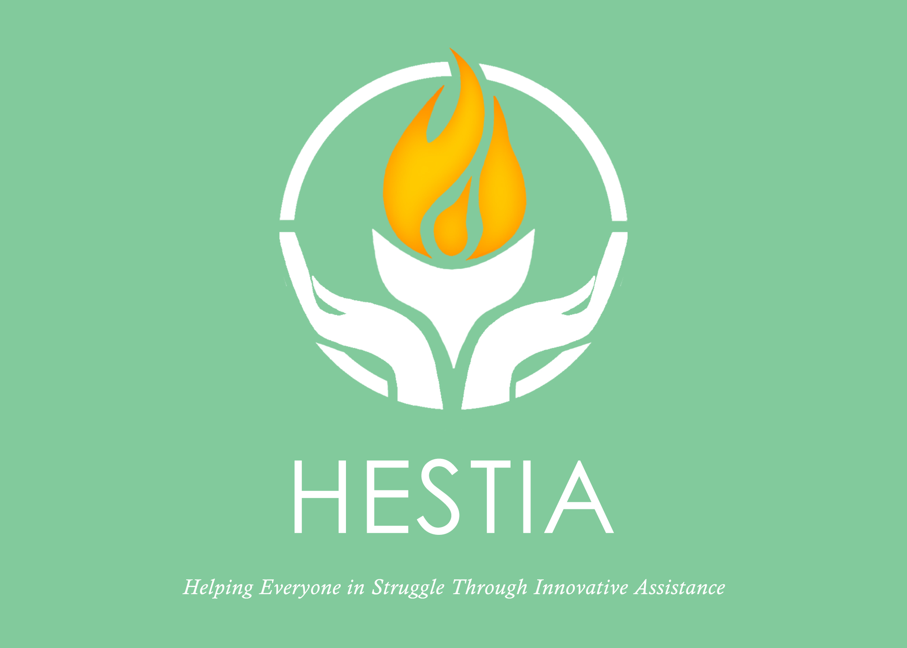

# HESTIA

## Table of Contents
1. About HESTIA
2. Features
3. Project Structure
4. UML
5. Kanban Board
6. Technologies Used
7. Future Plans
8. Team Members

## About HESTIA

### Problem Statement

In our world today, a significant challenge we face is the widespread issue of homelessness, affecting approximately 2% of the global population, which translates to around 150 million people. However, accurately understanding the extent of this crisis is complicated by various factors. Homeless individuals often avoid official registration due to fears of legal consequences, potential loss of custody, or societal stigma. This reluctance to be counted is a major obstacle in addressing the problem effectively.\
Zooming in on India, where more than four million people are reported to be homeless, poverty compounds the issue, exacerbated by the country's large population. Yet, there is a concern that these reported numbers may not capture the true magnitude of the problem due to challenges in data collection. The situation is no less dire on a regional scale, such as in Assam, where annual floods force nearly 300,000 people into temporary relief camps. The aftermath of these natural disasters leaves individuals disconnected from their families, with limited resources and, in some cases, no way of reconnecting.\
While commendable efforts are being made by government agencies, NGOs, and shelters to address homelessness, there remains a crucial gap in engaging the broader community in this collective endeavor. Our prototype app aims to fill this void by encouraging community participation and facilitating better collaboration between existing support systems and those affected by homelessness. By doing so, we hope to contribute to a more comprehensive and inclusive approach to alleviating the challenges faced by homeless individuals.

### Solution

We introduce **HESTIA**, a community based application that helps the community help homeless people by integrating various features that can help them.
Through HESTIA, we promote the United Nations's sustainable goals - _1. No Poverty, 10. Reduced Inequalities, 11. Sustainable Cities and Communities, and 16. Peace, Justice and Strong Institutions_. \
Our range of features include -
* **Crowdsourced Geotag Time Series Database Creation** - Collaborative data collection for mapping homeless populations over time.
* **Visualization through Region Maps and Markers** - Intuitive visual representation of homelessness trends using interactive maps and markers. These cover the regional stats in the form of -  total homeless sightings, crime incidents upon homeless people, upcoming events and functions organised by NGOs or Government Agencies, and finally a rating of the region determined by comprehensing the other fields.
* **Awareness Chatbot** - A conversational interface providing general information, assistance, and awareness about homelessness. Also provides additional information regarding any schemes or subisidies announced for the benefit of the homeless.
* **SOS System** - A reporting system that can sends alerts to dedicated portals for prompt assistance.
* **Web Portals for Management** - Dedicated web portals for Admins and NGOs to interact with the database.
  * **Admin Portals** - Admins can initiate database operations and manages region map generation, verification of markers, handling of SOS alerts, and provide data visualizations.
  * **NGO Portals** - NGOs can create announcements or post events, query database for relevant information, and faciliate community interaction.
* **Face-Tagged Database** - Clustering of faces in the database by using supervised and unsupervised face clustering. These face tags can be used to locate missing individuals, identifying potential criminals, identification of specific people who are need of required resources by NGOs or Government Agencies, or monitor suspicious individuals.
* **Community Page** - Display events with address and time, post announcements, request donations, donate to causes, help find missing individuals, and general community engagement.
* **Gamification** - To further improve engagement with the community, points are rewarded to individuals by acts of volunteering, posting reports, helping in spreading awareness, etc. These points will be then posted on a regional and global leaderboards.