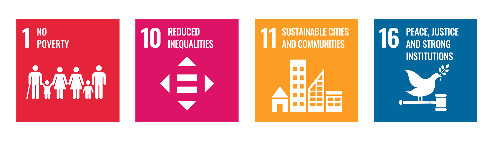
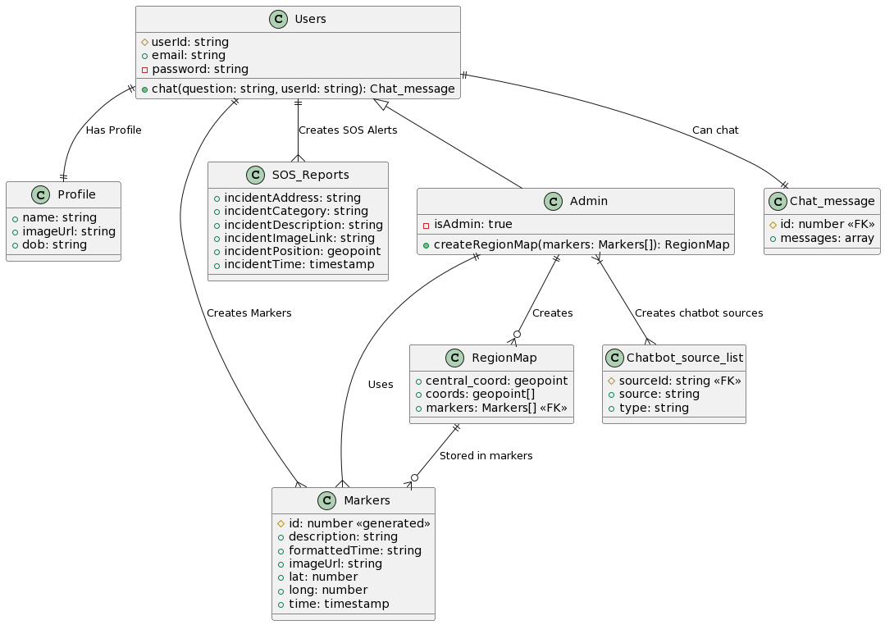
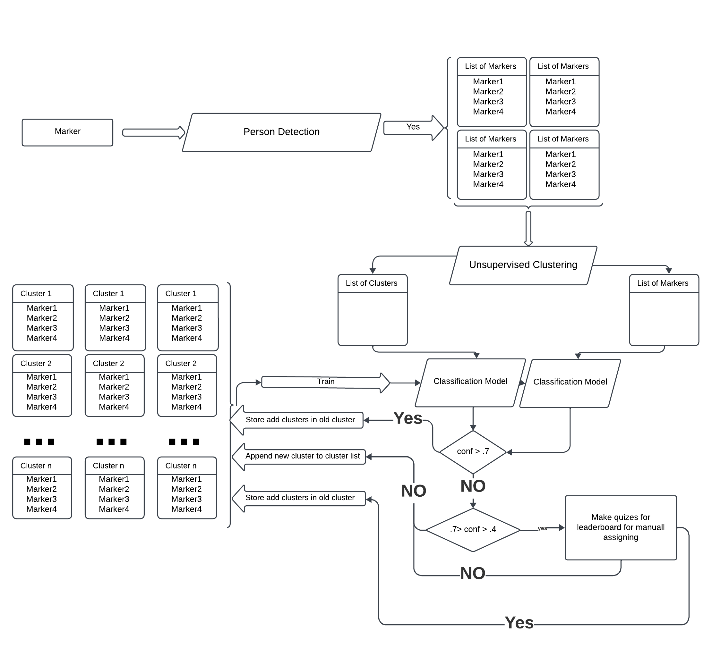
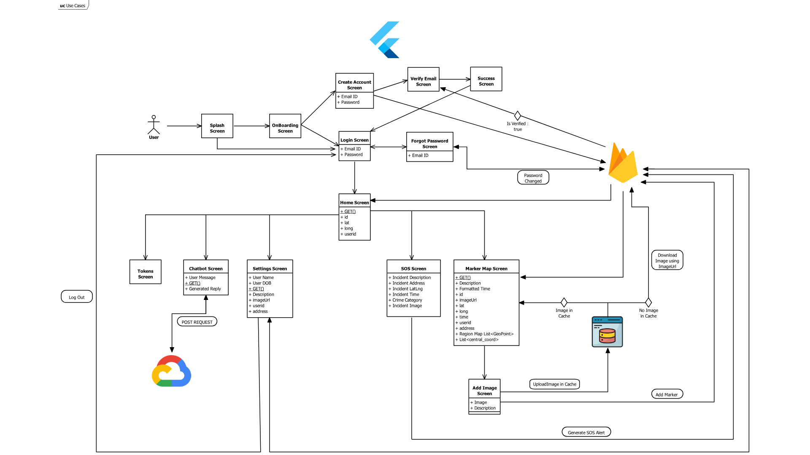
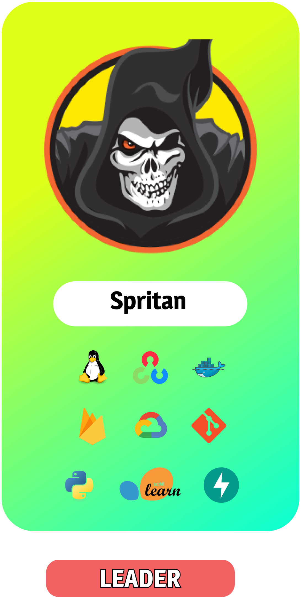
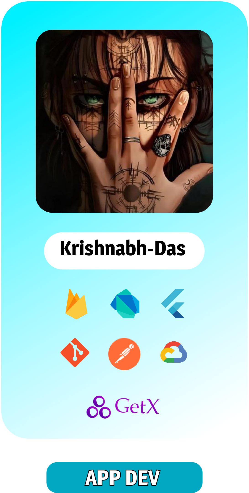
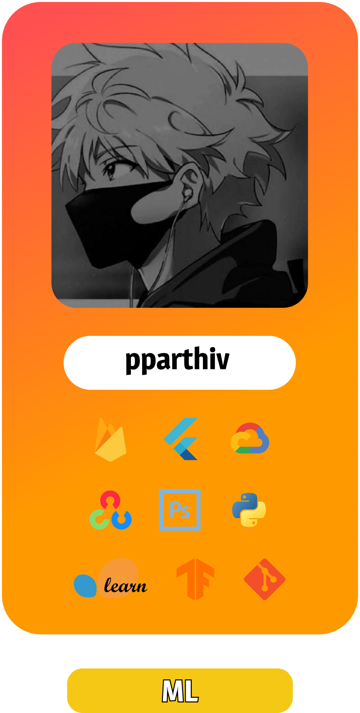

# HESTIA


<p align="center">
  
  <a href="https://drive.google.com/drive/folders/1W5xxgia2wo2nWwau3822tc9HDlfLKTMT?usp=sharing"><strong>Try out the Flutter App »</strong></a>
</p>
<p align="center">
  
  <a href="https://hestia-admin-panel.netlify.app/"><strong>Try out the Admin Portal »</strong></a>
</p>
<p align="center">
  
  <a href="https://hestia-ngo-portal.netlify.app/"><strong>Try out the NGO Portal »</strong></a>
</p>

## Table of Contents
1. [About HESTIA](#about-hestia)
2. [Features](#features)
3. [Project Structure](#project-structure)
4. [Diagrams](#diagrams)
5. [Kanban Board](#kanban-board)
6. [Technologies Used](#technologies-used)
7. [Future Plans](#future-plans)
8. [Team Members](#team-hestia)

## About HESTIA

### Problem Statement
Approximately 150 million people, or 2% of the world's population, are affected by homelessness, which is a global issue today. The fact that many are avoiding official registration out of fear of the law and social stigma makes it difficult to accurately measure this situation. Poverty exacerbates the issue of homelessness in India, where over four million individuals are thought to be homeless; however, difficulties in gathering data may understate the issue. The situation is made worse by regional issues, such as the yearly floods in Assam, which force about 300,000 people into relief camps. In spite of the wonderful efforts made by many organizations, community involvement is essential. By encouraging community involvement and improving coordination across support systems, our prototype app aims to close this gap and address homelessness from a more inclusive perspective.
### Solution
Introducing **HESTIA**, a groundbreaking community-centered application poised to tackle homelessness head-on. HESTIA revolutionizes the way society addresses this pressing issue by harnessing the power of community engagement and technological innovation. Serving as a dynamic platform, HESTIA seamlessly integrates a multitude of user-friendly features aimed at empowering individuals to make a meaningful impact in the lives of the homeless. From its intuitive homeless sighting markers that facilitate assistance to its SOS alerts system designed to respond to urgent situations, HESTIA stands as a beacon of hope for those in need. Moreover, the platform enables users to contribute directly to non-governmental organizations through streamlined donation channels, ensuring vital resources reach those who need them most. Furthermore, HESTIA facilitates missing person searches, fostering collaboration among community members in locating and reuniting individuals with their loved ones. Its innovative homelessness visualizations provide valuable insights into the scale and scope of the issue, empowering communities to enact informed solutions. Additionally, HESTIA utilizes public alerts via posts and its interactive chatbot to disseminate crucial information and foster dialogue on homelessness-related matters. With HESTIA, we embark on a collective journey towards a more compassionate and inclusive society, where every individual has the opportunity to thrive.
Through HESTIA, we promote the United Nations's sustainable goals - _1. No Poverty, 10. Reduced Inequalities, 11. Sustainable Cities and Communities, and 16. Peace, Justice and Strong Institutions_.



## Features

Our range of features include -

* **Crowdsourced Geotag Time Series Database Creation** - Collaborative data collection for mapping homeless populations over time.
* **Visualization through Region Maps and Markers** - Intuitive visual representation of homelessness trends using interactive maps and markers. These cover the regional stats in the form of -  total homeless sightings, crime incidents upon homeless people, upcoming events and functions organised by NGOs or Government Agencies, and finally a rating of the region determined by comprehensing the other fields.
* **Awareness Chatbot** - A conversational interface providing general information, assistance, and awareness about homelessness. Also provides additional information regarding any schemes or subsidies announced for the benefit of the homeless.
* **SOS System** - A reporting system that can send alerts to dedicated portals for prompt assistance.
* **Web Portals for Management** - Dedicated web portals for Admins and NGOs to interact with the database.
  * **Admin Portals** - Admins can initiate database operations and manage region map generation, verification of markers, handling of SOS alerts, and providing data visualizations.
  * **NGO Portals** - NGOs can create announcements or post events, query databases for relevant information, and facilitate community interaction.
* **Face-Tagged Database** - Clustering of faces in the database by using supervised and unsupervised face clustering. These face tags can be used to locate missing individuals, identify potential criminals, identification of specific people who need required resources by NGOs or Government Agencies, or monitor suspicious individuals.
* **Community Page** - Display events with address and time, post announcements, request donations, donate to causes, help find missing individuals, and general community engagement.
* **Gamification** - To further improve engagement with the community, points are rewarded to individuals by acts of volunteering, posting reports, helping in spreading awareness, etc. These points will be then posted on regional and global leaderboards.


## Project Structure
```
├── 🌐 assets
├── 📱 client
│   ├── 🧑‍💼 AdminClient
│   │   ├── jsconfig.json
│   │   ├── package.json
│   │   ├── package-lock.json
│   │   ├── public
│   │   └── src
│   ├── 🧑‍💻 NGOClient
│   │   ├── jsconfig.json
│   │   ├── package.json
│   │   ├── package-lock.json
│   │   ├── public
│   │   └── src
│   └── 👤 UserClient
│       ├── analysis_options.yaml
│       ├── android
│       ├── assets
│       ├── ios
│       ├── lib
│       ├── linux
│       ├── macos
│       ├── pubspec.lock
│       ├── pubspec.yaml
│       ├── README.md
│       ├── test
│       ├── web
│       └── windows
├── 📚 docs
│   └── uml.wsd
├── 📄 environment_droplet.yml
├── 💼 HESTIA.code-workspace
├── 📓 notebooks
│   ├── 📂 data
│   ├── 🔑 keys
│   ├── Step1_Firestore_regionmaps.ipynb
│   ├── Step2_chatbot.ipynb
│   ├── Step3_human_detection.ipynb
│   ├── Step4_face_clustering
│   ├── Step5_RegionMap_Scoring.ipynb
│   ├── Step6_RadialStats.ipynb
│   └── Step7_TakeInput.ipynb
├── 📝 README.md
└── 🖥️ server
    ├── cloudFunctions
    │   ├── firebase.json
    │   ├── functions
    │   └── README.md
    └── custom_backend
    │   ├── configs
    │   ├── custoimErrors
    │   ├── docker-compose_beta.yaml
    │   ├── docker-compose_dev.yaml
    │   ├── Dockerfile
    │   ├── docs
    │   ├── main.py
    │   ├── processor
    │   ├── __pycache__
    │   ├── requirements.txt
    │   ├── schemas
    │   └── utils
    └── pipelines
        ├── human_detection
        └── clustering_classification


```

## Diagrams

### Class Diagram



### Machine Learning Pipeline


### App Architecture


## Kanban Board


## Technologies Used
* **Android** - Flutter
* **Frontend** - React, Redux, MUI
* **Backend** - Firebase, FastAPI
* **Database** - Firestore, AstraDB
* **DevOps** - GitHub, Google Cloud Platform, Docker
* **Design** - Figma, FigJam, PlantUML, Canva
* **Machine Learning** - TensorFlow, scikit-learn, OpenCV, Langchain, Gemini-Pro
* **Google Technologies Used** - Flutter, Firebase, Google Cloud Platform, Tensorflow, Google Colab, Google Maps Platform, Google Analytics, Gemini-Pro

## Future Plans
* Establish alliances with global organizations for increased use and promotion.
* Adapt the platform to make it relevant worldwide and accessible to people of different cultures and backgrounds.
* Form business alliances to promote sponsorship and workforce collaboration.
* Integrate social media for optimal reach and simple sharing.
* Use innovative and advanced analytics tools to gain insights in real time.
* Improve AI capabilities to provide more precise support.
* Create agreements for data exchange with organizations.
* Improve leaderboard functionality to maintain long-term user interest.
* Ally with government organizations to ensure that the transfer of resources to the homeless is properly monitored.
* Redeem HESTIA tokens to get merchandise featuring homelessness awareness on t-shirts and other items.

## How to Setup the Project


## Team HESTIA

<div>
  <table>
    <tr>
      <td><a href="https://github.com/Spritan"></a></td>
      <td><a href="https://github.com/Krishnabh-Das"></a></td>
      <td><a href="https://github.com/pparthiv"></a></td>
      <td><a href="https://github.com/Tirthankar03"></a></td>
    </tr>
  </table>
</div>

